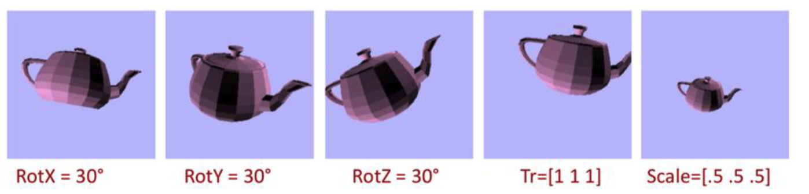
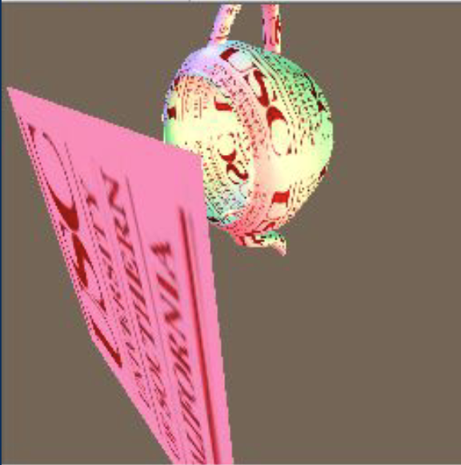

# Gz Graphics Library

## Overview
The Gz Graphics Library is a basic rendering system designed to support various rendering tasks including pixel management, rasterization, transformations, shading, and texturing. Below are the key features implemented:

- **Display and Pixel Management**: Created and managed a pixel-based display using a frame buffer. Supported writing display content to PPM format and visualizing results in a Windows frame buffer.

- **Triangle Rasterization with Z-Buffer**: Implemented a triangle rasterizer using scan-line conversion techniques. Performed Z-buffering for hidden surface removal. Interpolated Z-values for each pixel within triangles.

- **Transformations and Camera Setup**: Supported rotation, translation, and scaling transformations using matrix operations. Utilized a matrix stack for incremental transformation management. Provided camera setup with field-of-view, position, and orientation controls. Clipped triangles behind the view plane for optimal rendering.

- **Shading Techniques**: Added flat shading, Gouraud shading (vertex color interpolation), and Phong shading (per-pixel normal interpolation). Enabled interpolation of colors and normals across triangle surfaces. Supported ambient and directional lighting with customizable light properties.

- **Texturing and Procedural Textures**: Enabled texture mapping with PPM image support. Applied perspective-corrected texture interpolation for accurate mapping. Implemented bilinear texture interpolation for enhanced visual quality. Created procedural textures with user-defined patterns.

## Samples
### Transformations:

### Shading:

### Texturing:

